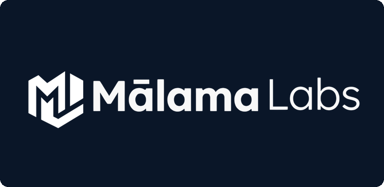

<p align="center">
  
</p>

# Mālama Labs

Mālama Labs is a DePIN (Decentralized Physical Infrastructure Network) startup building a cryptographic environmental data network. We utilize hardware-signed data from specialized sensors (ATECC608A + BME680) as the root of trust, completely removing human-in-the-loop oracles. The platform employs a dual-token model ($MALAMA and $LCO2/$VCO2) with transactions bridged seamlessly between Cardano (Aiken/CIP-68) and Base (EVM/LayerZero).

Our architecture provides a secure pipeline from data birth to multi-chain settlement. Sensor data forms a Merkle tree batch, is uploaded to IPFS (via Pinata), validated by an AI validator using Apache Kafka and OPA/Rego policies, and finally anchored on-chain every 4 hours. Every component is designed with strict invariants, and our Next.js frontend is built with the highest standards of modern UX.

## Architecture

```text
+--------------------+
|   Sensor Device    |
| (Py + ATECC608A +  |
|      BME680)       |
+---------+----------+
          | (Hardware Signed Data)
          v
+---------+----------+
|  Kafka / Pipeline  |
| (Merkle Batching)  |
+---------+----------+
          |
    +-----+-----+
    |           |
    v           v
+---+---+   +---+---+
| IPFS  |   |  OPA  |
|(Pinata|   | (Rego)|
+---+---+   +---+---+
    |           |
    +-----+-----+
          |
+---------+----------+
|    AI Validator    |
+---------+----------+
          | 
+---------+----------+
| Blockchain Anchor  |
| (Cardano / Base)  |
+--------------------+
```

## Quick Start

### Frontend (Next.js)

```bash
cd apps/web
npm install
npm run dev
```

### EVM Contracts (Base)

```bash
cd contracts/evm
npm install
npx hardhat test
```

### Validator Pipeline (Docker)

```bash
docker-compose up -d
```

### Cardano Contracts (Aiken)

```bash
cd contracts/cardano
aiken build
aiken check
```

## Documentation

- [Audit Invariants](docs/audit/invariants.md)
- [Protocol Specifications](docs/protocol/specs.md)
- [Hardware Setup](docs/hardware/setup.md)

## Deployment (Vercel)

The frontend ([apps/web](apps/web)) deploys to Vercel. There are currently two Vercel projects linked to this repository:

- `malamalaunch` — primary project, auto-deploys from `main`
- `launch-malamalabs-com` — project owning the `launch.malamalabs.com` custom domain

**Required Vercel dashboard configuration for both projects:**

1. **Root Directory:** `apps/web`
2. **Framework Preset:** Next.js (auto-detected)
3. **Build Command:** (leave blank — use framework default `next build`)
4. **Output Directory:** (leave blank — use framework default `.next`)
5. **Install Command:** (leave blank — use framework default `npm install`)

With both projects configured this way, no `vercel.json` is required at the repo root. Next.js auto-detection handles everything.

If either project is misconfigured with Root Directory set to repo root, the build will fail with *"The Next.js output directory '.next' was not found"* because the monorepo root has no Next.js app. Fix via Project Settings → General → Root Directory.

